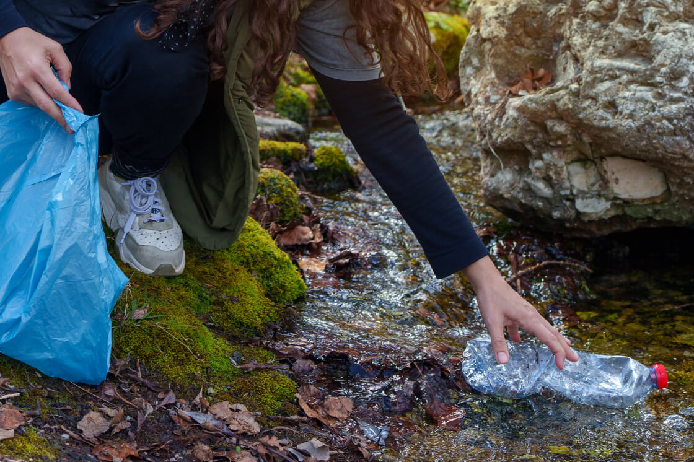
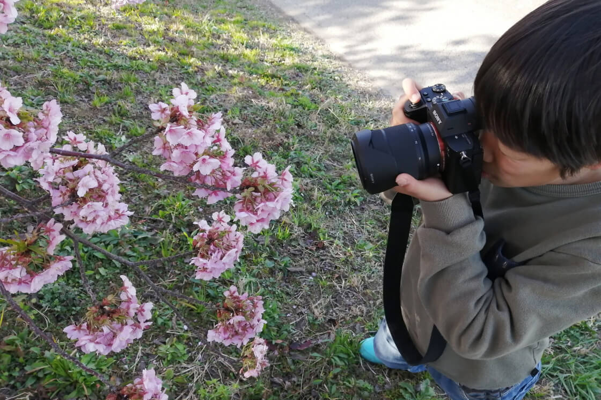

## 2025 年 9 月 13 日

## 作業内容

・Our Activities セクション コーディング 
・News セクション コーディング

## 気づき・学び

▶ 課題：Grid では右だけずらすのが難しい 
「Our Activities」セクションの PC 表示において、2 列 2 行のカードを表示する構成で以下の問題が発生。 

・CSS Grid を用いて、1 つの ul にカード 4 枚（2 列 2 行）を配置。 
・右列カードにのみ margin-top を指定しても、左右の高さが揃い、余白が崩れる 
・Grid では個別に高さをずらす調整が困難 

▶ 課題 2：Flex でも 1 つの ul 内では調整不可 
・flex-wrap: wrap を用いて 1 つの u> に 4 枚配置したが、左右のカードの高さが揃ってしまう。 
・align-items: flex-start を指定しても効果なし 
・左右の高さの独立が困難 

▶ 解決策：左右を別の ul に分割 
・左右をそれぞれ別の ul としてマークアップ 
・親要素に display: flex を指定し、横並びに構成 
・右側の ul にのみ margin-top を指定してずらしを実現 

結果、 
・高さの自動揃えを回避 
・各デバイスでの余白を安定化 
・デザイン通りのレイアウトを再現可能 

## HTML コード

                

                    <ul class="our-Activities__list">
                        <li class="our-Activities__item">
                            

                            <h3 class="our-Activities__itemHeading">自然環境の保全</h3>
                            

                                山・森・川の清掃活動を通じて、豊かな自然を次世代へと引き継ぎます。 
                                ゴミを拾う小さな一歩が、自然本来の美しさを取り戻す大きな力になると信じています。
                            

                        </li>

                        <li class="our-Activities__item">
                            

                            <h3 class="our-Activities__itemHeading">環境教育と啓発活動</h3>
                            

                                子どもから大人まで、自然や動物と共に生きる大切さを学ぶワークショップやイベントを実施しています。 
                                体験を通して「守りたい」という気持ちを育てます。
                            

                        </li>
                    </ul>

                    <ul class="our-Activities__list">
                        <li class="our-Activities__item">
                            

                            <h3 class="our-Activities__itemHeading">動物とのふれあいの場づくり</h3>
                            

                                人と動物が安心して触れ合える機会を提供し、命の尊さを実感できる体験を広げています。 
                                この体験が、人々の優しさと理解を育みます。
                            

                        </li>

                        <li class="our-Activities__item">
                            

                            <h3 class="our-Activities__itemHeading">共に広げる活動の輪</h3>
                            

                                地域住民やボランティアの方々と協力し、持続可能な取り組みを進めています。 
                                共に行動することで、より大きな力となり、社会全体へと意識を広げていきます。
                            

                        </li>
                    </ul>
                

## scss コード

@include mq(l) {
.our-Activities {
padding: clamp(100px, 11vw, 160px) 0;

    &__headingWrapper {
      margin-bottom: 0;
    }

    .flex {
      @include flex__column;
      justify-content: space-between;
      align-items: flex-start;
      margin-bottom: clamp(56px, 6vw, 80px);
    }

    // リスト
    &__listArea {
      width: 70%;
      flex-direction: row;
      margin-left: auto;
      justify-content: space-between;
    }

    &__list {
      width: 45%;
      row-gap: 7vw;
    }

    // リスト  右の列
    &__list:nth-of-type(2) {
      margin-top: 4vw;
    }

    &__item {
      width: 100%;

      // 画像
      &Img {
        margin-bottom: clamp(20px, 2.2vw, 24px);
      }

      // 見出し
      &Heading {
        margin-bottom: clamp(12px, 1.3vw, 16px);
        font-size: clamp(20px, 2vw, 26px);
      }
    }

}
}
